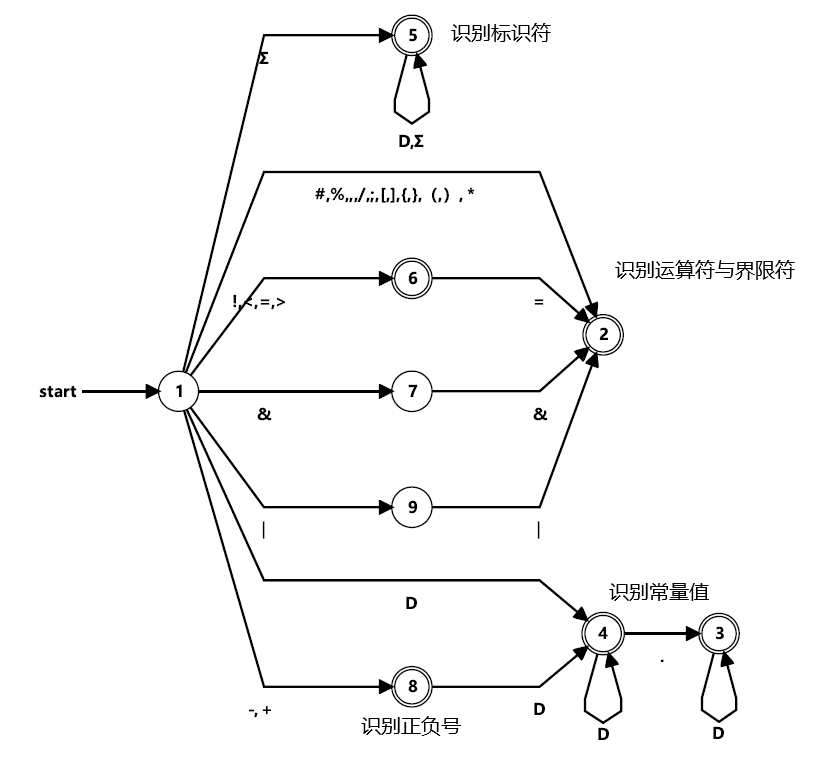

### 1 Mini语言的形式化描述

Mini语言是一个功能简洁的语言，其设计过程借鉴了C语言以及Python语言的词汇表与词法规则。

令集合$D=\{0,1,2,\cdots,9\}$，$A=\{A,B,C,\cdots,Z\}\cup \{a,b,c,\cdots,z\}$，$\Sigma=A \cup \{ \_ \}$

匹配Mini语言所有单词符号的正规式$r$如下所示：

$r=(Σ(Σ|D)^*)|(+|-)?D^+(.D^*)?| \text{＋|-|*|/|%|==|!=|<|<=|>|>=|&&|!|(||)|[|]|(|)|,|#|;|\{|\}|=}$

其中，匹配标识符和保留字的正规式为$\Sigma(\Sigma|D)^*$，匹配常量值的正规式为$(+|-)?D^+(.D^*)?$

**注：Mini语言严格区分大小写。**

### 2 Mini语言的单词编码表

Mini语言的所有单词符号及其类别号的对应关系如下表所示。

| 单词符号           | 类别号 | 单词符号 | 类别号 |
| ------------------ | ------ | -------- | ------ |
| 标识符（identity） | 0      | (        | 21     |
| 常量（number）     | 1      | )        | 22     |
| {                  | 2      | ,        | 23     |
| }                  | 3      | ;        | 24     |
| =                  | 4      | //       | 25     |
| +                  | 5      | return   | 26     |
| -                  | 6      | false    | 27     |
| *                  | 7      | true     | 28     |
| /                  | 8      | begin    | 29     |
| %                  | 9      | end      | 30     |
| ==                 | 10     | if       | 31     |
| !=                 | 11     | continue | 32     |
| <                  | 12     | else     | 33     |
| <=                 | 13     | while    | 34     |
| >                  | 14     | program  | 35     |
| >=                 | 15     | func     | 36     |
| &&                 | 16     | const    | 37     |
| \|\|               | 17     | var      | 38     |
| !                  | 18     | break    | 39     |
| [                  | 19     | array    | 40     |
| ]                  | 20     | call     | 41     |

### 3 状态转换图

该状态转换图由正规式

$r=(Σ(Σ|D)^*)|(＋|-)?D^+(.D^*)?| \text{＋|-|*|/|%|==|!=|<|<=|>|>=|&&|!|(||)|[|]|(|)|,|#|;|\{|\}|=}$

转换而来



### 4 词法分析算法

在运行词法分析器之前，我们先对源程序进行预处理，预处理过程的算法流程如下：

```
对于源程序的每一行：
	if 该行有注释（该行有#符号）：
		删除#及其之后的所有字符
	删除该行前后缀的空格
	if 删除该行前后缀的空格后该行为空：
		continue(考虑下一行)
	将该行中连续的两个及以上的空格变成只有一个空格（删除多余的空格）
	将该行写入到存放预处理代码的临时文件中
```

我们采用Python语言进行词法分析算法的实现，并采用面向对象的程序设计方法。程序中设计了五个类如下：

1. `FARule`：自动机的转移规则，属性包括一个状态、该状态可以识别的字符、识别该字符后到达的状态

2. `Token`：单词属性字，属性包括单词的属性`type`、属性号`typeno`、属性值`value`

3. `LexError`：异常类，词法分析器识别到非法的字符后会抛出异常进行报错

4. `DFA`：确定性有限自动机，属性包括当前状态、初始状态、接受状态集和转移规则集合，有一个关键方法`inputChar(char)`，该方法输入为一个字符，方法内会遍历转移规则集合内的所有转移规则，根据当前状态和输入字符寻找对应的转移规则，根据规则获取下一个状态，并把下一个状态置为当前状态，如果寻找对应的转移规则，说明能够识别该字符，方法返回`True`，若遍历完所有的转移规则之后没有寻找到对应的转移规则，则说明不能够识别输入的字符，返回`False`

5. `Lexer`：扫描器，该类中关键属性包括类型与类型号的映射表`type2val`、保留字表`reserved`、操作符与限界符表`oper_deli`、常量表`num_table`、符号表`sym_table`、扫描器扫描的经过预处理后的源代码字符串`data`、当前扫描到的位置`cur_pos`、当前扫描到的行号`lineno`（行号用于报错时用）、确定性有限自动机`dfa`，关键方法为`getToken()`，每次调用该方法都会得到一个`Token`（当源代码字符串扫描完毕之后返回`None`），下面给出该方法的算法流程:

   ```
   if data为空串:	# 说明还没有输入源代码字符串
   	raise RuntimeError('No input string for scanning')	# 抛出异常
   if 位置指针cur_pos >= len(data):	# 说明已经扫描完毕
   	return None
   if data[cur_pos] == “ ” or data[cur_pos] == “\t” or data[cur_pos] == “\n”:
   	# 当前字符是空格或制表符或回车
   	cur_pos++
   	if data[cur_pos] == “\n”:
   		lineno++	# 增加行号
   	return getToken()  # 前移位置指针，递归调用该方法
   dfa.reset()	()	# 将自动机的当前状态恢复为初态
   word = ""	# 该次调用识别到的单词，每识别到一个字符，都会将该字符加入word中
   while cur_pos < len(data) and dfa.inputChar(self.data[self.cur_pos]):
   	# 还没有扫描完所有输入字符，并且自动机能够识别该字符
   	word += data[cur_pos]	# 将本次识别到的字符加入到word中
   	cur_pos++
   # 循环结束意味着已扫描完所有字符或者自动机遇到了无法识别的字符
   if dfa.isAccept():	# 判断自动机当前是否处于接受状态
   	ac_state = dfa.cur_state	# 得到自动机的当前状态
   	# 由ac_state查表ac_dict得知，ac_dict中存有每个接受态对应识别到的串的类型
   	ac_type = dfa接受时识别到的串是什么类型	
   	if ac_type == "id":	# 如果识别到的是标识符
   		# 还没有扫描完所有输入字符，并且当前字符不是限界符与运算符（包括空格）
   		if cur_pos < len(data) and data[cur_pos] not in oper_deli:
   			# 抛出异常，标识符和保留字后面只能跟限界符与运算符（包括空格）
   			raise LexError(lineno, data[cur_pos])
   		if word in self.reserved:	# 当前识别到的字是否在保留字表中
   			将Token的类型和值设置为该保留字所对应的类型和值
   		else:	# 识别到的字是标识符
   			查询该标识符是否在符号表中，若在，则返回该标识符对应的表索引，否则将其加入到表中
   			将Token的类型和值设置为标识符对应的类型和值
   	else if: ac_type == "number":	# 识别到的是常量
   		if cur_pos < len(data) and data[cur_pos] not in oper_deli:
   			# 抛出异常，标识符和保留字后面只能跟限界符与运算符（包括空格）
   			raise LexError(lineno, data[cur_pos])
   		else:
   			查询该常量是否在常量表中，若在，则返回该常量对应的表索引，否则将其加入到表中
   			将Token的类型和值设置为常量对应的类型和值
   	return Token
   # 自动机当前没有处于接受状态，说明遇到了无法识别的字符，抛出异常，扫描停止
   # 将当前行号和指针指向的字符传入到异常对象中，供报错提示时使用
   raise LexError(lineno, data[cur_pos])
   ```

在main方法中，首先根据输入的文件名读入该文件中的源代码并将其进行预处理，然后根据我们所得到的Mini语言的自动机的状态转换图创建转移规则，构建自动机对象`dfa`、构建扫描器对象`mini_lexer`，循环调用扫描器的`getToken()`方法得到`Token`，直到`getToken()`方法返回`None`或者报错。

***注意：***

我们需要注意的是，`+`和`-`既可以作为单目运算符也可以作为二目运算符，在表达式`j-1`中，若`-`作为单目运算符，我们可以得到两个单词符号`j`和`-1`；若`-`作为二目运算符，我们可以得到三个单词符号`j`、`-`、`1`，根据上面我们画出的自动机，由于最长匹配原则，在类似于`j-1`的表达式中，我们总是会将`-`视作单目运算符，然后得到常量单词`-1`，但这样实际是不对的，我们需要解决这个问题。解决方案如下：

我们不需要对自动机根据最长匹配原则识别常量的规则进行修改，但是在识别到一个常量后，我们检查这个常量单词符号的第一个字符是不是`+`或`-`，如果是，我们检查这个单词符号的上一个单词符号，看看上一个单词符号是否可以进行二元运算，在Mini语言中可以进行二元运算的单词符号为：`["id", "number", "false", "true"]`，如果上一个单词符号可以进行二元运算，这个`+`或者`-`就需要解释为二目运算符，同时我们需要将字符指针回溯到`+`或`-`后面一个位置，等待下一次重新识别这个数字；如果上一个单词符号不能进行二元运算，这个`+`或者`-`就需要解释为单目运算符，我们不需要做任何改动。根据这种方法，我们只需要在程序中添加一个变量`last_token`记录上一个单词符号。

### 5 测试计划

测试用例所包括的单词符号应该覆盖Mini语言的各个种类的单词符号，包括关键字、标识符、算术运算符、逻辑运算符、常量定义、变量定义、数组定义、注释。除了从语言所包括的单词符号考虑之外，还应该从程序的结构来考虑，一个常见的程序应该包括顺序结构、选择结构、循环结构，并且还要包括函数定义与函数调用。

考虑到这些因素，我们决定使用**用Mini语言实现的冒泡排序算法程序**作为**正测试用例**，冒泡排序算法虽然精简，但却满足上述条件。

对于**负测试用例**，由于本次实习只涉及到词法分析，不涉及语法分析与语义分析，所以我们只需在测试用例程序中考虑两点：

1. 使用不在Mini语言字母表中的字符，例如定义变量`var abc@1 = 2;`，`@`符号并不包括在Mini语言的字母表中。
2. 使用非法的标识符或常量，如`2121abc`，`2121abc`既不是一个合法的标识符也不是一个合法的常量。词法分析器遇到此类情况应当报错。
3. 使用Mini语言没有包括的运算符或限界符，如`|`。

由于我们采用了预处理方法，预处理会剔除源程序中的注释、多余的空格、空行，为了验证预处理方法是否正常工作，我们可以在测试程序中添加一些多余的空格、空行以及注释。

下面列出负测试用例及其运行结果：

```
program bubble_sort
// swap the value of a and b
func swap(a, b)
	begin
	var tmp = a;
	a = b;
	b = tmp;  return;
end
end

// bubble sort
begin
	const len = 5;
	array a[len ] = {4.0, 5.1,     1.0, 6.12, 9.98};	// array define
	var i@ = 1;	// Illegal character
	while(i < len - 1)
	begin
		var j = len - 1, exchange = false;
		while (  j-1 >= i)
		begin
			if ( a[j] < a[j-1 ] )
			begin
				call swap ( a[j],  a[j-1]);
				exchange = true;
			end
			j = j - 1;
		end
		if(!exchange) 	break;
		else i = i + 1    ;
	end
end
end
```

运行结果部分截取如下：

```
<program(35), program>
<id(0), bubble_sort(0)>
<func(36), func>
<id(0), swap(1)>
<((21), (>
<id(0), a(2)>
<,(23), ,>
<id(0), b(3)>
<)(22), )>
<begin(29), begin>
<var(38), var>
<id(0), tmp(4)>
<=(4), =>
<id(0), a(2)>
<;(24), ;>
<id(0), a(2)>
...
...
...
<}(3), }>
<;(24), ;>
<var(38), var>
Traceback (most recent call last):
  File ".\lexing.py", line 19, in <module>
    token = mini_lexer.getToken()
  File "F:\编译原理作业\Mini语言构造实习\code\MiniLexer.py", line 170, in getToken
    return self.getToken()
  File "F:\编译原理作业\Mini语言构造实习\code\MiniLexer.py", line 183, in getToken
    raise LexError(self.data[self.cur_pos if self.cur_pos < len(self.data) else len(self.data) - 1], self.line_dict[self.lineno])
MiniLexer.LexError: Scanning error. Illegal character '@' at row:15.
```

为了人眼调试方便，Token打印的内容为：**<单词类型（类型号），单词值（若该单词类型是标识符或常量该单词在常量表或符号表中的索引）>**

