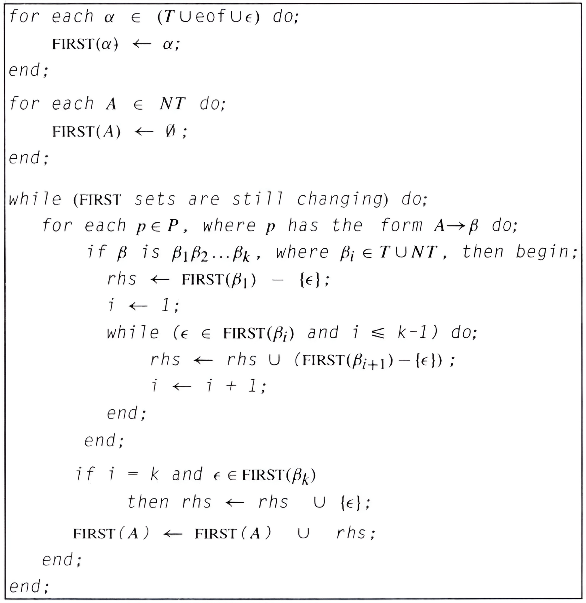

## 1 Mini语言的语法规则

Mini语言包含程序设计所需的最基本语言成分，包括但不限于：

1. 常量、变量、数组、函数和程序等声明
2. 包括整型、浮点型、布尔型以及数组等数据类型
3. 算术表达式、逻辑表达式、赋值语句、条件语句、while语句、函数调用语句等基本控制结构

下面用EBNF给出Mini语言的语法规则：

* <程序>::="program"<程序标识符><程序体>"end"
* <程序体>::={<语句>|<函数定义>}
* <复合语句>::="begin"{<语句>}"end"
* <函数定义>::="func"<函数标识符>"("[参数表]")"<语句>"end"
* <返回语句>::="return"[<表达式>]";"
* <形式参数表>::=<标识符>{","<标识符>}
* <实际参数表>::=<表达式>{","<表达式>}
* <语句>::=<单语句>|<复合语句>|<空语句>|<返回语句>|<break语句>|<continue语句>
* <break语句>::="break"";"
* <continue语句>::="continue"";"
* <单语句>::=<赋值语句>|<条件语句>|<循环语句>|<函数调用语句>|<常量说明语句>|<变量说明语句>
* <空语句>::=";"
* <变量说明语句>::=<简单变量说明语句>|<数组变量说明语句>
* <简单变量说明语句>::="var"<简单变量定义>{,<简单变量定义>}";"
* <数组变量说明语句>::="array"<数组变量定义>{,<数组变量定义>}";"
* <数组变量定义>::=<标识符>\["["<表达式>"]"\]["=""{"<表达式>{,<表达式>}"}"]
* <简单变量定义>::=<标识符>["="<表达式>]
* <常量说明语句>::="const"<标识符>"="<表达式>{","<标识符>"="<表达式>}";"
* <赋值语句>::=<变量>"="<表达式>";"
* <条件语句>::="if""("<表达式>")"<语句>["else"<语句>]
* <循环语句>::="while""("<表达式>")"(<语句>)
* <函数调用语句>::="call"<函数标识符>"("[<实际参数表>]")"";"
* <表达式>::=<简单表达式>{<关系运算符><简单表达式>}
* <关系运算符>::"=="|"<"|">"|"<="|">="|"!="
* <简单表达式>::=["+"|"-"]<项>{<加法运算符><项>}
* <加法运算符>::="+"|"-"|"||"
* <项>::=<因子>{<乘法运算符><因子>}
* <乘法运算符>::="*"|"/"|"%"|"&&"
* <因子>::=<常量值>|<变量>|"true"|"false"|''("<表达式>")"|"!"<因子>
* <变量>::=<变量标识符>["["<表达式>"]"]

## 2 Mini语言的文法定义

将描述Mini语言语法规则的EBNF转换成上下文无关文法`G(PROGRAM)`如下（大写表示非终结符，小写表示终结符）：

```
PROGRAM -> program id PROBODY end
PROBODY -> FUNCDEF PROBODY | SM PROBODY | ϵ
COMSM -> begin EXTSM end
EXTSM -> SM EXTSM | ϵ
FUNCDEF -> func id ( SELARGS ) EXTSM end
RETURNSM -> return RETVAL ;
RETVAL -> EXP | ϵ
SELARGS -> ARGS | ϵ
ARGS -> id EXTARGS
EXTARGS -> , id EXTARGS | ϵ
SIGSM -> ASSM | IFSM | LOOPSM | CALLSM | CONSTSM | VARSM
ESM -> ;
SM -> SIGSM | COMSM | ESM | RETURNSM | BREAKSM | CONTINUESM
BREAKSM -> break ;
CONTINUESM -> continue ;
VARSM -> SIMVARSM | ARRVARSM
SIMVARSM -> var SIMVARAN EXTSIMVARAN ;
ARRVARSM -> array ARRVARAN EXTARRVARAN ;
EXTSIMVARAN -> , SIMVARAN EXTSIMVARAN | ϵ
EXTARRVARAN -> , ARRVARAN EXTARRVARAN | ϵ
SIMVARAN -> id SIMVARAN'
ARRVARAN -> id [ EXP ] ARRVARAN'
SIMVARAN' -> ϵ | = EXP
ARRVARAN' -> ϵ | = { EXP EXTEXP }
EXTEXP -> , EXP EXTEXP | ϵ
CONSTSM -> const CONAN EXTCONAN ;
CONAN -> id = EXP
EXTCONAN -> , CONAN EXTCONAN | ϵ
ASSM -> VARIABLE = EXP ;
IFSM -> if ( EXP ) SM ELSE
ELSE -> else SM |  ϵ
LOOPSM -> while ( EXP ) SM
CALLSM -> call id ( SELACARGS ) ;
SELACARGS -> ACARGS | ϵ
ACARGS -> ACARG EXTACARGS
ACARG -> EXP
EXTACARGS -> , ACARG EXTACARGS | ϵ
EXP -> SIMEXP EXTSIMEXP | call id ( SELACARGS )
EXTSIMEXP -> RELOP SIMEXP EXTSIMEXP | ϵ
RELOP -> == | < | > | <= | >= | !=
SIMEXP -> POSNEG ITEM EXTITEM
POSNEG -> + | - | ϵ
EXTITEM -> ADDOP ITEM EXTITEM | ϵ
ADDOP -> + | - | ||
ITEM -> FACTOR EXTFAC
EXTFAC -> MULOP FACTOR EXTFAC | ϵ
MULOP -> * | / | % | &&
FACTOR -> false | true | number | VARIABLE | ( EXP ) | ! FACTOR
VARIABLE -> id VARIABLE'
VARIABLE' -> ϵ | [ EXP ]
```

> 注：实际上，在将EBNF转换成上下文无关文法`G(PROGRAM)`的过程中，我们已经做了消除左递归与提取左公共因子的工作，但是文法`G`没有办法转换成LL(1)文法，这是**if-else语句中的悬挂else问题**所导致的，在LL(1)分析表中`(ELSE, else)`对应的格子中有两个产生式，分别为`ELSE -> else SM`与`ELSE -> ϵ`，原因是当分析栈顶的非终结符`ELSE`遇到输入符号`else`时不能确定`else`是对应哪一个`if`，我们采用**else就近匹配原则**解决这个问题，即匹配离该`else`最近的`if`，算法具体内容我们在下一节进行阐述。

下面我们将利用LL(1)预测分析法构造LL(1)语法分析器对Mini语言的源程序进行识别分析。

## 3 **语法分析算法**

我们使用Python语言实现语法分析算法，并采用面向对象的程序设计方法。程序中设计了三个类如下：

1. `CFG`：上下文无关文法类，该类定义了一个上下文无关文法G。主要属性包括文法G的非终结符集合`Vn`，终结符集合`Vt`，文法开始符号`start`，产生式集合`prods`，所有文法符号的Fisrt集合`firsts`，所有非终结符的Follow集合`follows`，文法G的LL(1)分析表`LL_1_table`。主要方法包括`getFirsts()`、`getFollows()`、`getParseTable()`，它们分别计算文法G的First集合、Follow集合、LL(1)分析表，伪代码如下：

   * `getFirsts()`

     

   * `getFollows()`

     

   * `getParseTable()`

     

2. `MiniParser`：Mini语言语法分析器类，内部包含了一个词法分析器`lexer`和一个上下文无关文法`cfg`。该类有两个方法：`nextWord()`负责从`lexer`处取出下一个`token`，`LL_1_parse()`负责进行LL(1)语法分析，`LL_1_parse()`的伪代码如下：

   

3. `MiniParseError`：语法分析异常类（出错处理类），在进行LL(1)语法分析的过程中遇到错误将会抛出该异常类的对象，其具体实现逻辑在下一节进行阐述。

在主程序`main.py`中，我们首先根据输入的源代码文件名读入文件中的源代码字符串并将其进行预处理，将预处理后的源代码字符串传入扫描器对象`mini_lexer`。我们将上下文无关文法`G(PROGRAM)`的所有产生式放入文件`mini_cfg.txt`中，然后将该文件名、文法G的非终结符集合Vn、终结符集合Vt、开始符号start等传入`CFG`类的构造方法以创建上下文无关文法对象`cfg`，`cfg`在构造方法中会解析出文件中的所有产生式并求出First集合、Follow集合、LL(1)分析表，然后将`mini_lexer`和`cfg`传入`MiniParser`类的构造方法中以构造分析器对象`mini_parser`，最后调用`mini_parser.LL_1_parse()`开始分析，若分析成功，程序打印`Parsing success.`，否则抛出`MiniParseError`异常类对象进行报错。

## 4 出错处理出口

Mini语言的语法分析器由异常类`MiniParseError`完成报错工作，打印错误信息及出错位置。在LL(1)预测分析法中，报错一定是由于我们不能正确构造组成某一个产生式右侧的终结符号串所导致的，根据这个思路，我们只需确定**在错误位置处我们正在构造组成哪一个产生式右侧的终结符号串**，在确定这个产生式后，由于每一个产生式的左部非终结符都对应一个语法单位，此时可以确定在源程序中关于该语法单位的单词符号串不符合语法规则，我们直接打印错误信息"该语法单位错误即可"。现在的问题变成了如何确定我们正在构造哪一个产生式的右侧，注意到在LL(1)预测分析算法中，有一步是将分析栈顶的非终结符替换为该非终结符对应的产生式右部，我们只需在原来的LL(1)分析算法中增加一个非终结符栈`nt_stack`用来记录当前正在构造哪些非终结符对应产生式的右部，并且为我们感兴趣的那些非终结符排定一个优先级，只有优先级比`nt_stack`栈顶元素高的非终结符才能入栈，当栈顶的非终结符对应的产生式右部构造完毕之后就将其出栈，当遇到错误时，栈顶的非终结符对应的语法单位就是源程序的单词符号无法构造的语法单位。下面列出我们所包含的错误信息以及该错误对应的产生式（产生式左部就是我们感兴趣的非终结符，错误信息括号中的数字表示该非终结符的优先级，数字越大优先级越高）：

| 错误信息              | 对应的产生式                                             |
| --------------------- | -------------------------------------------------------- |
| 程序定义错误（1）     | `PROGRAM -> program id PROBODY end`                      |
| 函数定义错误（2）     | `FUNCDEF -> func id ( SELARGS ) EXTSM end`               |
| 简单变量说明错误（5） | `SIMVARSM -> var SIMVARAN EXTSIMVARAN ;`                 |
| 数组变量说明错误（5） | `ARRVARSM -> array ARRVARAN EXTARRVARAN ;`               |
| 常量说明错误（5）     | `CONSTSM -> const CONAN EXTCONAN ;`                      |
| 赋值语句错误（5）     | `ASSM -> VARIABLE = EXP ;`                               |
| 条件语句错误（4）     | `IFSM -> if ( EXP ) SM ELSE`<br />`ELSE -> else SM |  ϵ` |
| 循环语句错误（4）     | `LOOPSM -> while ( EXP ) SM`                             |
| 函数调用语句错误（5） | `CALLSM -> call id ( SELACARGS ) ;`                      |
| 表达式错误（7）       | `EXP -> SIMEXP EXTSIMEXP`                                |

通过观察不难发现，优先级低的非终结符对应的产生式右部包含了优先级高的非终结符，以条件语句`IFSM -> if ( EXP ) SM else SM`为例，我们在构造`IFSM`的时候，要先构造`SM`，而`SM`对应的产生式右侧出现了赋值语句对应的非终结符`ASSM`，我们要先构造`ASSM`才能构造`IFSM`，在报错时也应该是报`ASSM`的错误信息。

## 5 测试计划

测试用例中所包括的语法单位应该尽可能覆盖Mini语言的文法中的所有非终结符，包括程序定义、函数定义、变量与常量声明、数组声明、各种类型的语句、表达式等语法单位，为了满足上述所有要求，我们决定使用**用Mini语言实现的快速排序算法程序**作为**正测试用例**，快速排序算法虽然精简但具有一定的复杂度，可以满足上述条件。

对于**负测试用例**，我们只需在正测试用例的基础上写出与错误信息表格中出现的那些错误项相关的错误代码即可。

下面列出负测试用例：

```
program QuickSortAlgo
	// swap the value of a and b
	func swap(a, b)
		var tmp = b;
		// tmp = b;
		b = a;
		a = tmp;
		return;
	end
	
	func quickSort(A, left, right)
		if(left < right)
		begin
            mid = call split(A, left, right);
            call quickSort(A, left, mid - 1);
            call quickSort(A, mid + 1, right);
        end
        return;
	end
	
	const n = 6;
	array A[n] = {1,2,3,4,5.1,-2.1};
	
	func split(A, left, right)
		var i = left, x = A[left], j = right;
		while(i != j)
		begin
			while(j > i && A[j] > x) j--;	# Mini语言没有递减运算符--，此处正确的应该是 j = j - 1;
			while(j > i && A[i] <= x) i = i + 1 + 2 - 2;
			if(i < j) call swap(A[i], A[j]);
		end
		call swap(A[i], A[left]);
		return i;
	end
	
	call quickSort(A, 0, n-1);
	
end
```

执行程序得到结果如下：

```
PS F:\编译原理作业\Mini语言构造实习\code> python .\parsing.py .\parse_test_neg.mini
Traceback (most recent call last):
  File ".\parsing.py", line 20, in <module>
    mini_parser.LL_1_parse()
  File "F:\编译原理作业\Mini语言构造实习\code\MiniParser.py", line 160, in LL_1_parse
    raise MiniParseError(word.value, self.lexer.line_dict[self.lexer.lineno], nt_stack[-1][0])
MiniParser.MiniParseError: Parsing failed, expression error. Illegal word '-' at row:28.
```

在第28行的语句`j--;`中，`j`被`lexer`识别为一个标识符，第一个`-`被识别为二元运算符减号，此时分析器期望下一个单词符号是一个表达式，但是此时是一个`-`，所以分析器抛出异常报错`Parsing failed, expression error. Illegal word '-' at row:28.`